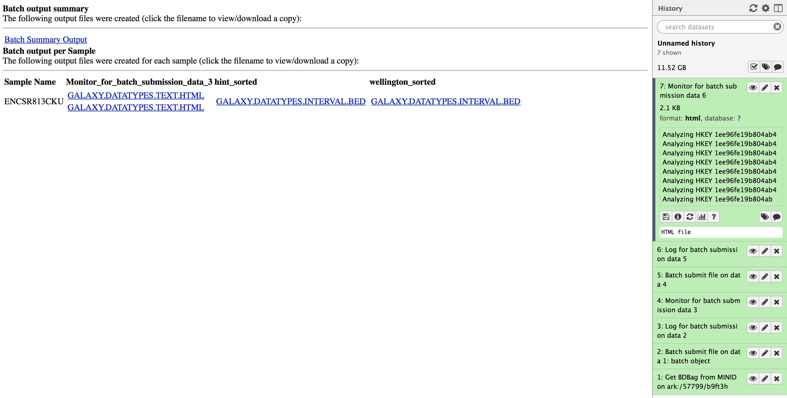

# Reproducible big data science: A case study in continuous FAIRness

# Table of Contents

- [Introduction](#introduction)
- [Glossary](#glossary)
- [Prerequisites](#prerequisites)
- [FAIRness](#1-evaluation-of-fairness)
- [Reproducibility](#2-evaluation-of-reproducibility)
    - [Screenshot of Workflow](#screenshot-of-workflow)
    - [Input biosample](#selecting-an-input-biosample)
    - [Process steps](#process-steps)
        - [Log on to BDDS Globus Genomics](#log-on-to-bdds-globus-genomics)
        - [Generate API Key](#generate-api-key)
        - [Import published workflows](#import-published-workflows)
        - [Execute analysis](#execute-analysis)
        - [Results](#results)
    - [Intersect footprints with FIMO](#instructions-to-intersect-hint-or-wellington-footprints-output-with-the-fimo-database)
    - [Output validation](#output-validation)
- [Survey](#survey)

# Introduction

In this tutorial we will demonstrate how to reproduce a biomedical analysis using a set of tools developed by the [Big Data to Discovery Science](http://bd2k.ini.usc.edu/) BD2K center. Our goal here is to provide a set of instructions that enable a reader to evaluate the FAIRness (Findability, Accessibility, Interoperability and Reusabiblity) of the data and analysis presented in the manuscript titled ["Reproducible big data science: A case study in continuous FAIRness"](https://www.biorxiv.org/content/early/2018/06/20/268755) using a representative data sample of urinary bladder from the [ENCODE](www.encodeproject.org) project.

Specifically we show a multi-step analysis that creates an atlas of putative transcription factor binding sites from terabytes of ENCODE DNase I hypersensitive sites sequencing data.

After going through the instructions, please provide your feedback through the survey [here](https://goo.gl/forms/Ag35eRlgiXithlx43).

# Glossary

- BDBag: A data packaging and exchange format based on the BagIT specification. BDBags allow for the exchange of collections of files and metadata by enumerating their elements, regardless of their location.
- Minid: A lightweight identifier for unambiguous naming of data products. Minds can be associated with files (or BDBags), resolved using a resolution service (e.g., [name-to-thing](http://n2t.net)).
- Research Object (RO): A way of representing a dataset and its contents with arbitrary levels of detail, regardless of their location (description).
- Globus: A hosted service that provides a collection of capabilities for managing, transfering, sharing, publishing, and discovering research data. Find out more [here](https://www.globus.org/).
- Globus Genomics:  A hosted instance of Galaxy on the cloud that features integrated integrated Globus authentication and data management, automated elasticity on Amazon Web Services (AWS), and a collection of best practices analysis pipelines.

# Prerequisites

- Install the BDBag tooling
    ```pip install bdbag```
- A [Globus](https://www.globus.org) account (you can either login using your institutional identity or create a Globus ID online)
- Membership in a Globus group to access analysis services. Please join the group [here](https://www.globus.org/app/groups/6f9dd64a-a22c-11e8-95d8-0efa7862ab5c)

# 1 Evaluation of FAIRness
We first demonstrate how the tools used in this tutorial enable FAIR access to data.

In the corresponding manuscript (Tables 2 and 3) we provided a list of all the minids created and used in the analysis. These minids allow readers to locate (via a public resolver) the BDBags for each sample used in the study.  The BDBags contain all input data needed for analysis along with metadata describing each sample.

Here, as an example, we provide the minid of the urinary bladder tissue: [ark:/57799/b9ft3h](http://minid.bd2k.org/minid/landingpage/ark:/57799/b9ft3h). When you click on the link, it will take you to the landing page of the urinary bladder tissue data as shown in the screenshot below:


The landing page provides basic metadata about the object, including when it was created and by whom, a checksum for the contents, and a set of locations where the object is available.

By clicking on the link under Locations, one can download the BDBag of urinary bladder data.

The following instructions show you how to download the BDBag, download its contents, and validate its contents. These are the same tools we have used in the following steps to download the raw data to Globus Genomics, perform analysis and generate results.

1. Download the BDBag for urinary bladder (a zip filled called ce6417d1-6ff7-4eb4-9412-b74743af2ff8.zip):

```wget https://s3.amazonaws.com/bdds-public/bags/input_tissues_bags/ce6417d1-6ff7-4eb4-9412-b74743af2ff8.zip```

2. Run checksum to verify the integrity of the data (compare this against the checksum listed for the minid):

```
sha256sum ce6417d1-6ff7-4eb4-9412-b74743af2ff8.zip
39689dfa3eb438e1ebc4bbb0bbad391169b0f7e0990a798ed8512e4c051b6c2f  ce6417d1-6ff7-4eb4-9412-b74743af2ff8.zip
```

3. Use the BDBag tools to download and validate the contents of the BDBag (note this will download ~3.5GB of data):

```
unzip ce6417d1-6ff7-4eb4-9412-b74743af2ff8.zip
bdbag --resolve-fetch all ce6417d1-6ff7-4eb4-9412-b74743af2ff8

2018-08-22 14:37:20,253 - INFO - Attempting to resolve remote file references from fetch.txt.
2018-08-22 14:37:20,258 - INFO - Attempting GET from URL: https://www.encodeproject.org/files/ENCFF002DZB/@@download/ENCFF002DZB.fastq.gz
2018-08-22 14:40:29,715 - INFO - File [/Users/madduri/paper_test/bdb/ce6417d1-6ff7-4eb4-9412-b74743af2ff8/data/ENCFF002DZB.fastq.gz] transfer successful. 726.847 MB transferred at 3.85 MB/second. Elapsed time: 0:03:08.590712.
2018-08-22 14:40:29,716 - INFO - Attempting GET from URL: https://www.encodeproject.org/files/ENCFF002DZD/@@download/ENCFF002DZD.fastq.gz

2018-08-22 14:43:42,683 - INFO - File [/Users/madduri/paper_test/bdb/ce6417d1-6ff7-4eb4-9412-b74743af2ff8/data/ENCFF002DZD.fastq.gz] transfer successful. 732.293 MB transferred at 3.81 MB/second. Elapsed time: 0:03:12.300711.
2018-08-22 14:43:42,686 - INFO - Attempting GET from URL: https://www.encodeproject.org/files/ENCFF002DZE/@@download/ENCFF002DZE.fastq.gz
2018-08-22 14:48:52,751 - INFO - File [/Users/madduri/paper_test/bdb/ce6417d1-6ff7-4eb4-9412-b74743af2ff8/data/ENCFF002DZE.fastq.gz] transfer successful. 1076.481 MB transferred at 3.48 MB/second. Elapsed time: 0:05:09.459530.
2018-08-22 14:48:52,752 - INFO - Attempting GET from URL: https://www.encodeproject.org/files/ENCFF002DZF/@@download/ENCFF002DZF.fastq.gz
2018-08-22 14:54:26,946 - INFO - File [/Users/madduri/paper_test/bdb/ce6417d1-6ff7-4eb4-9412-b74743af2ff8/data/ENCFF002DZF.fastq.gz] transfer successful. 1095.671 MB transferred at 3.28 MB/second. Elapsed time: 0:05:33.683174.
2018-08-22 14:54:26,950 - INFO - Fetch complete. Elapsed time: 0:17:06.690463
```

```
bdbag --validate fast ce6417d1-6ff7-4eb4-9412-b74743af2ff8

2018-08-22 14:59:50,176 - INFO - Validating bag: /Users/madduri/paper_test/bdb/ce6417d1-6ff7-4eb4-9412-b74743af2ff8
2018-08-22 14:59:50,181 - INFO - Bag /Users/madduri/paper_test/bdb/ce6417d1-6ff7-4eb4-9412-b74743af2ff8 is valid
```
You have now discovered, downloaded, and validated the contents of one of the input files used in the subsequent analysis. These steps aim to demonstrate that access to the data is FAIR.

In the subsequent sections, the reader can use this input data to run the footprints workflows in Globus Genomics to generate footprints from Hint and Wellington algorithms.

# 2 Evaluation of Reproducibility

In this section we describe how to generate footprints using two algorithms: hint and wellington. The workflow is designed such that it can process any input biosample for which a minid/BDBag are available.

Note: these steps take several hours to complete.

The results for analyzing the urinary bladder dataset are available at [ark:/57799/b9wd55](http://n2t.net/ark:/57799/b9wd55). For interested readers we also provide an [R notebook](http://footprints.bdds.globusgenomics.org) that demonstrates how the generated atlas of TFBS can be reused, thus demonstrating the four attributes of digital objects that are often viewed as fundamental to data-driven discovery.

## Generating Footprints

To generate footprints we use a high performance workflow available in Globus Genomics: [https://bdds.globusgenomics.org](https://bdds.globusgenomics.org). The workflow integrates a number of sub-workflows as shown in figure below to generate alignment files for all replicates in biosample; then merge replicate alignment files for a patient to a single alignment file; and finally, to call the footprint algorithms for each biosample.

Each step of the process will be described such that any user logged on to Globus Genomics should be able to re-generate the footprints for a tissue type. Due to the high amount of computation used, we will provide instructions on generating footprints using data from urinary bladder as input.

## Screenshot of Workflow

The workflow consists of one master workflow which manages the sub-workflows. The input to the master workflow is the mind for the tissue type you wish to generate footprints for. As described above, the minids represent a BDbag for the tissue type which contains the DNAse data from the ENCODE database. These minids and BDbags have been previously generated. The red box in the master workflow submits (in parallel) the alignment sub-workflow for each biosample in the tissue type. Each biosample may contain 1 to many replicates, thus, each replicate must be individually aligned and sorted (gray box). Once the replicates for a biosample are aligned, they are merged to a single alignment file representing a biosample. When all merged biosample alignment files are completed (red box) an alignments BDbag is generated and used as input to generate the footprints (green box).


## Selecting an input biosample

We provide a minid for the Urinary bladder tissue type. Although this tissue type is small, the footprint search and generation process may take several hours. The minid for urinary bladder is: [ark:/57799/b9ft3h](http://n2t.net/ark:/57799/b9ft3h).


## Process steps

We're now ready to run the anlysis workflow. The steps below will show you how to import and execute the footprint generation master workflow.

### Log on to BDDS Globus Genomics

Users will need to log on to [https://bdds.globusgenomics.org](https://bdds.globusgenomics.org). Please ensure that you have followed the [prerequisites](#Prerequisites) to gain access to Globus Genomics. Only users with access to the instance will be allowed to submit and run workflows.

### Generate API Key

Once logged in, you will first need to generate an API key to allow for high performance, batch execution of your workflows.  If you already have an API key for [https://bdds.globusgenomics.org](https://bdds.globusgenomics.org), then you can skip this step.

 1) Click on the "User" menu item in the top of the page:

 

 2) Click on the "Preferences" sub-menu item:

 

 3) Select the "Manage API key" item in the next page:

 

 4) If you do not have an API key, "None" will be shown on the page. Click the "Create new key" button and one will be generated.

 

 5) You can go back to the main page at: https://bdds.globusgenomics.org

### Import published workflows

Next you will need to import all needed workflows into your environment. If you have previously imported these workflows, you do not need to import them again.

NOTE - If you modify any of the workflows or rename the workflows you import, it is likely that your analysis will not work. If you would like to modify a workflow and generate a new set of workflows with different tools or parameters, please contact us at support@globus.org.

You will need import each of the following workflows:

 * [Footprints MASTER Workflow]( https://bdds.globusgenomics.org/u/arodri1215/w/copy-of-imported-footprints-master-workflow-4)
 * [SNAP_BAG_MASTER_v.1.1.0](https://bdds.globusgenomics.org/u/arodri1215/w/copy-of-snapbagmasterv100)
 * [DNAse-footprints-singlesample-bamInput_wellington_hint]( https://bdds.globusgenomics.org/u/arodri1215/w/imported-dnase-footprints-singlesample-baminputwellingtonhint)
 * [snap_from_minid_bag]( https://bdds.globusgenomics.org/u/arodri1215/w/snapfromminidbag)

For each workflow in the list above, follow these steps to import to your environment:

 1) Click on the workflow's link (above i.e. "Footprints MASTER Workflow")
 2) Select the "Import workflow" icon (green + icon)

 

### Execute analysis

Now you have imported the workflows and configured the API key for execution you are now ready to execute the analysis. Note: the analysis can take a few hours to download the data, perform alignment, and generate footprints for each of the biosamples and its replicates of the tissue type.

 1) Go to your [workflow environment page](https://bdds.globusgenomics.org/workflow)

 2) You should see the 4 workflows you just imported:

 

 3) Select the "Run" option for the master workflow "imported: Footprints MASTER Workflow"

 

 4) Click on the "Run workflow" option. The minid has been entered for you.

 

That is all you need to do. You should now see a series of jobs appear in your history panel. These jobs are getting queued up and will start running as soon as resources become available. Once the items in the history become green, your data will have been generated.

### Results

The output for the master workflow is a BDBag for the biosample used as input. The output contains the footprints generated in the workflow. The BDbag and minid for the sample submitted in this tutorial can be located at: [ark:/57799/b9wd55](http://n2t.net/ark:/57799/b9wd55).

Please download the footprints generated from the workflows by clicking on the "Monitor for batch submission data 6" and downloading the files under hint_sorted and wellington_sorted columns. These are two bed files called ENCSR813CKU.hint_sorted.galaxy.datatypes.interval-3.Bed and ENCSR813CKU.wellington_sorted.galaxy.datatypes.interval-3.Bed respectively. You can use these files to reproduce the results by following instructions in Output validation section below.




## Instructions to intersect hint or wellington footprints output with the FIMO database

This [repo](https://github.com/globusgenomics/genomics-footprint/tree/master/generate_db) includes the processing code to intersect [hint](http://www.regulatory-genomics.org/hint/introduction/) or [wellington](https://github.com/jpiper/pyDNase) footprints output with the FIMO database and save the results in your local directory or optionally put in a database.

- Important - make sure you have postgresql and R (3.4 or higher) installed on your machine. If not please install by:

  - For linux,
      ```
      sudo apt-get install postgresql postgresql-contrib libpq-dev libcurl4-openssl-dev unzip
      ```
   - For Mac,
      ```
        brew install postgresql
      ```


- To intersect footprints with TFBS motifs, you will first need to download, unpack and resolve the data. Here, we provide an example of the urinary bladder, seed 16 BDbag (i.e. minid ark:/57799/b9wd55):

  ```
  wget https://s3.amazonaws.com/bdds-public/bags/footprints_bags/urinary_bladder.seed16.tissue.bag.zip
  unzip ./urinary_bladder.seed16.tissue.bag.zip
  bdbag ./urinary_bladder.seed16.tissue.bag --resolve-fetch all

  ```

- Now you need to download the [tfbs.R](https://github.com/globusgenomics/genomics-footprint/blob/master/generate_db/src/tfbs.R) script:

  ```
  wget https://raw.githubusercontent.com/globusgenomics/genomics-footprint/master/generate_db/src/tfbs.R

  ```

  - You can use the BDBag as input to generate the TFBS for the urinary bladder (seed16, hint) BDBag by running the following.
    (to speed up, you may assign more cpus (i.e., -w 4) depending on the resource availability)

  ```
  $ Rscript ./tfbs.R -b ./urinary_bladder.seed16.tissue.bag -o ./hint_output -s 16 -t "urinary bladder" -m Hint -e -w 1

  ```

  - If you have placed your footprints BED files in a separate directory (not in the BDBag), then you can use this instead.
    (to speed up, you may assign more cpus (i.e., -w 4) depending on the resource availability)

  ```
  $ Rscript ./tfbs.R -i ./footprint_bed_files -o ./hint_output -s 16 -t "urinary bladder" -m Hint -e -w 1

  ```

    - The BDBag method will assume that you have downloaded the BDBag directly from its location and have not modified the contents of the bag. If you have modified the contents, then it's best to use the "-i" parameter to indicate location of the input footprint files.

  Note: The script is set to use 4 workers (cpus).  You can adjust this by modifying the "-w" parameter.

  You can also try to test quickly by setting the "-e" flag.
  This will capture the first 10 lines in the footprint input file and then intersect with FIMO.

- The output is a BDBag that contains compressed TFBS files for hint and wellington.

  For example, the [urinary_bladder_16 bdbag](https://github.com/globusgenomics/genomics-footprint/tree/master/generate_db/bdbag_output/urinary_bladder_16) contains the urinary_bladder_hint_16.tar.gz and urinary_bladder_wellington_16.tar.gz files.

## Output validation

To compare the output, please download this simple [R script](https://github.com/globusgenomics/genomics-footprint/tree/master/generate_db/validation/overlap_check.R) and then run:

   ```
   wget https://raw.githubusercontent.com/globusgenomics/genomics-footprint/master/generate_db/validation/overlap_check.R

   Rscript overlap_check.R urinary_bladder_hint_16_ENCSR813CKU_chr1.csv urinary_bladder_wellington_16_chr1.csv

  [1] "file1: 97 lines and file2: 95 lines that have 0 exact matches in footprints"
  [1] "file1: 97 lines and file2: 95 lines that have 140 exact matches in motifs"
  ```

To compare your own footprint output generated from the Globus Genomics workflow, you can follow the instructions below:

```
Rscript ./tfbs.R -i <directory where hint bed file is located>  -o ./output_hint -s 16 -t "urinary bladder" -m Hint -e

Rscript ./tfbs.R -i <directory where wellington bed file is located>  -o ./output_wellington -s 16 -t "urinary bladder" -m Wellington -e

Rscript ./overlap_check.R ./output_hint/TFBS_OUTPUT/urinary_bladder_hint_16.ENCSR813CKU.chr1.csv ./output_wellington/TFBS_OUTPUT/urinary_bladder_wellington_16.ENCSR813CKU.chr1.csv

[1] "file1: 97 lines and file2: 95 lines that have 0 exact matches in footprints"
[1] "file1: 97 lines and file2: 95 lines that have 140 exact matches in motifs"
```

# Survey
After going through the instructions, please provide your feedback through the survey [here](https://goo.gl/forms/Ag35eRlgiXithlx43)
