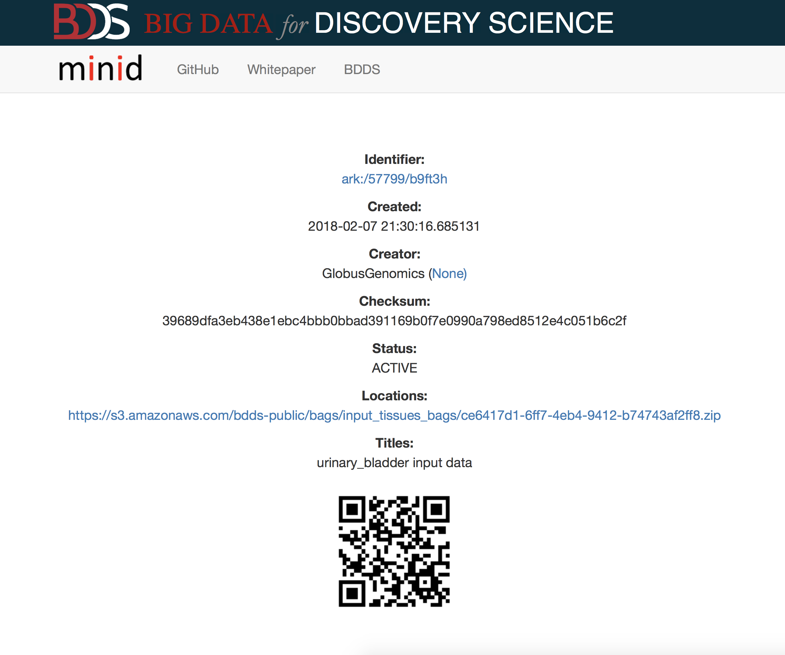
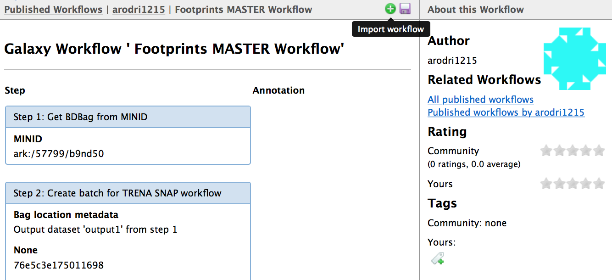
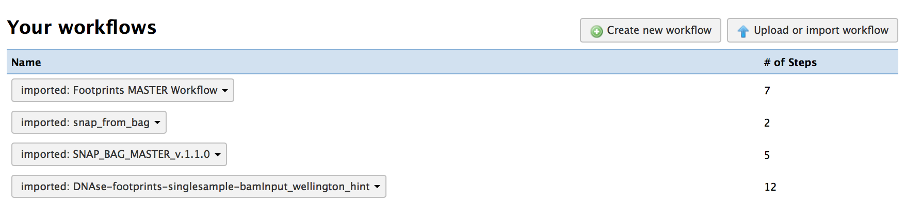
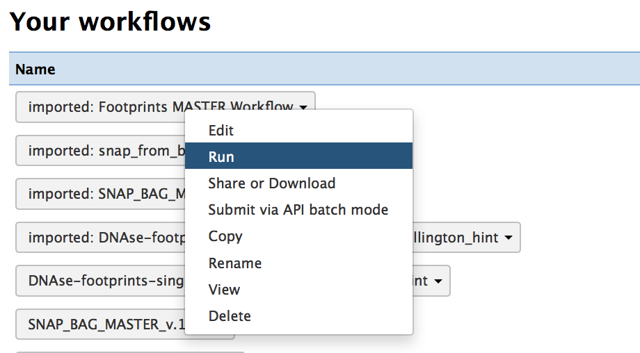
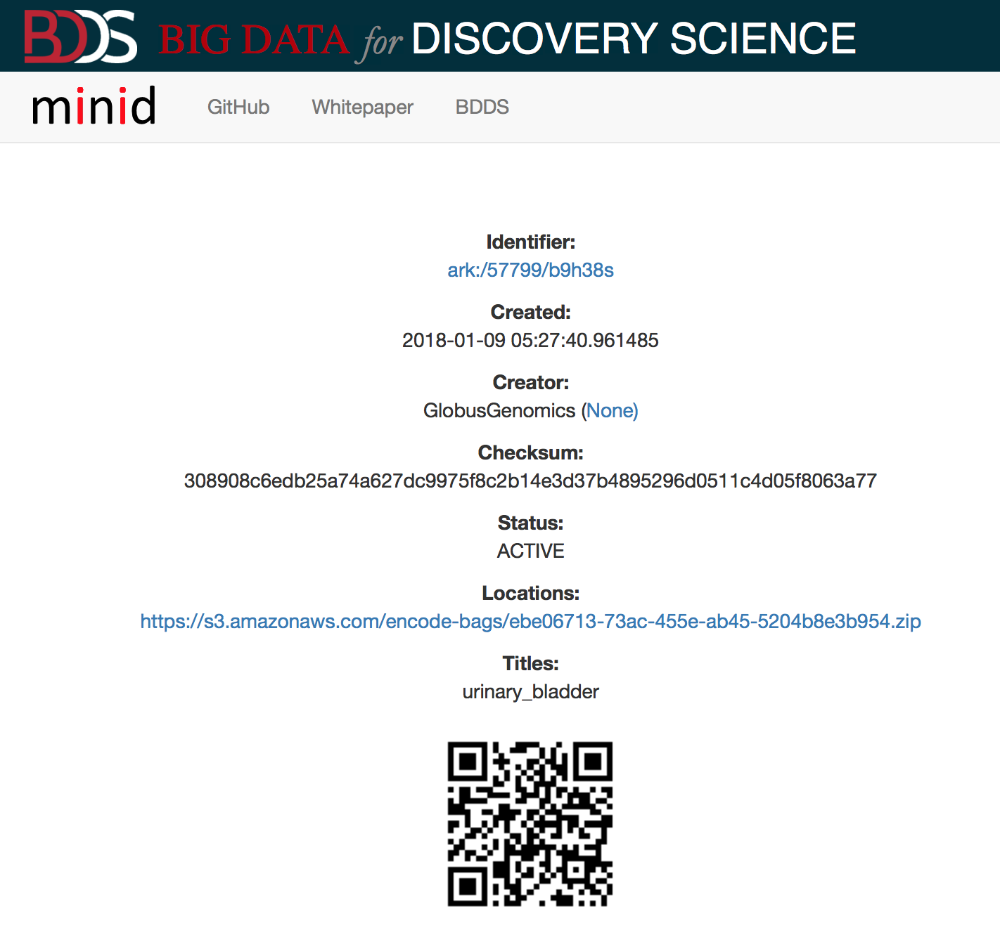

# Generate Footprints

This readme explains how to generate footprints for a tissue using as input the MINID for the desired tissue type.
Generating footprints requires running a workflow via https://bdds.globusgenomics.org which integrates a number of sub-workflows as shown in figure below to generate alignment files for all replicates in patients; then merging replicate alignment files for a patient to a single alignment file; finally, calling the footprint algorithms for each patient (i.e. Wellington, Hint).

Each step of the process will be laid out such that any user logged on to the system should be able to re-generate the footprints for a tissue type. Due to the high amount of computation used, we will supply a test MINID as input.

## Table of Contents

- [Screenshot of Workflow](#screenshot-of-workflow)
- [Test MINID](#test-MINID)
- [Process steps](#process-steps)
    - [Log on to BDDS Globus Genomics](#log-on-to-bdds-globus-genomics)
    - [Generate API Key](#generate-api-key)
    - [Import published workflows](#import-published-workflows)
    - [Execute analysis](#execute-analysis)
    - [Results](#results)

## Screenshot of Workflow

The workflow consists of one master workflow which manages the sub-workflows. The input to the master workflow is the MINID for the tissue type you wish to generate footprints for. The MINIDs represent a BDbag for the tissue type which contains the DNAse data from the ENCODE database. These MINIDs and BDbags have been previously generated. The red box in the master workflow submits in parallel the alignment sub-workflow for each patient in the tissue type. Each patient may contain 1 to many replicates, thus, each replicate must be individually aligned and sorted (gray box). Once the replicates for a patient are aligned, they are merged to a single alignment file representing a patient. When all merged patient alignemnt files are completed (red box) an alignemnts BDbag is generated and used as input to generate the footprints (green box).

## Test MIND

We provide a MINID for the Urinary bladder tissue type. Although this tissue type is small, footprint search and generation process may take several hours. The MINID for urinary bladder is: ark:/57799/b9ft3h

## Process steps

Follow along each step to launch the footprint generation master workflow.

### Log on to BDDS Globus Genomics

Users will need to log on to https://bdds.globusgenomics.org. Globus Genomics using Globus for authentication and Authorization. If you don't have a Globus account, you can create one from www.globus.org or log into Globus using your institutional account. We created a Globus Group that controls access to the BDDS Globus Genomics service. Users can become members of the group by clicking here: https://www.globus.org/app/groups/6f9dd64a-a22c-11e8-95d8-0efa7862ab5c. Please note that only users with access to the instance will be allowed to submit and run workflows. 

### Generate API Key

Once logged in, if this is the first time you are logging in or submitting the Footprints workflow and have not generated an API key before, you will need to create one now. If you already have an API key for the https://bdds.globusgenomics.org, then you can skip this step.

 1) Click on the "User" menu item in the top of the page:

 

 2) Click on the "Preferences" sub-menu item:

 

 3) Select the "Manage API key" item in the next page:

 

 4) If you do not have an API key, "None" will be shown in your landing page. You can click the "Create new key" button and one will be generated and shown to you in the screen.

 

 5) You can go back to the main page at: https://bdds.globusgenomics.org

### Import published workflows

Next you will need to import all needed workflows into your environment. If you have previously imported these workflows, you do not need to import them again.

NOTE - If you modify any of the workflows or rename the workflows you import, there is a strong possibility that your submission will not work. If you would like to modify a workflow and generate a new set of workflows with different tools or parameters, please contact us at support@globus.org.

You will need import each of the following workflows:

 * [Footprints MASTER Workflow]( https://bdds.globusgenomics.org/u/arodri1215/w/copy-of-imported-footprints-master-workflow-4)
 * [SNAP_BAG_MASTER_v.1.1.0](https://bdds.globusgenomics.org/u/arodri1215/w/copy-of-snapbagmasterv100)
 * [DNAse-footprints-singlesample-bamInput_wellington_hint]( https://bdds.globusgenomics.org/u/arodri1215/w/imported-dnase-footprints-singlesample-baminputwellingtonhint)
 * [snap_from_minid_bag]( https://bdds.globusgenomics.org/u/arodri1215/w/snapfromminidbag)

For each workflow in the list above, follow these steps to import to your environment:

 1) Click on the workflow's link (above i.e. "Footprints MASTER Workflow")
 2) Select the "Import workflow" icon (green + icon)

 

### Execute analysis

If you have completed the above required steps, you should be able to execute the analysis. The analysis can take a few hours to download the data for the MINID, perform alignment and generate footprints for each of the patients and its replicates of the tissue type.

 1) Go to your [workflow environment page](https://bdds.globusgenomics.org/workflow)
 2) You should see at least 4 workflows which you have imported:

 

 3) Select "Run" option for the workflow "imported: Footprints MASTER Workflow"

 

 4) Click on the "Run workflow" option. The MINID has been entered for you.

 

That is all you need to do. You should now see a series of jobs appear in your history panel. These jobs are getting queued up and will start running as soon as resources become available. Once the items in the history become green, your data will have been generated.

### Results

The output for the master workflow is a BDbag for the tissue type used as input. The output contains the footprints generated in the workflow. The BDbag and MINID for the sample submitted in this README file can be located at: ark:/57799/b9h38s

